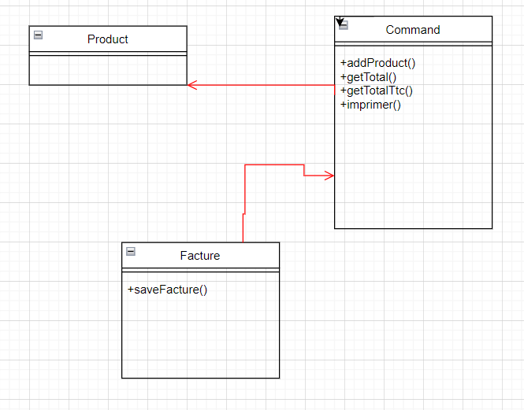

# **exercice 1**
## 1-Le principe du SOLID non respecte:
- Le principe du SOLID non respecte est **Single responsability principle**
- la classe Facture a plusieurs responsabilite :
1. Faire les calcules des prix totale
2. L'impression des prix
3. L'enregistrement de la facture

**on a plusieur raison pour changer cette classe**

aussi dans la fonction **imprimer()** on a une violation de ce principe
cette fonction :
1. calcule les prix pour chaque quantite de produit
2. Faire de l'impression

## 2-Nouvelle diagramme de classe

## 3-Implementation

## 4-Test