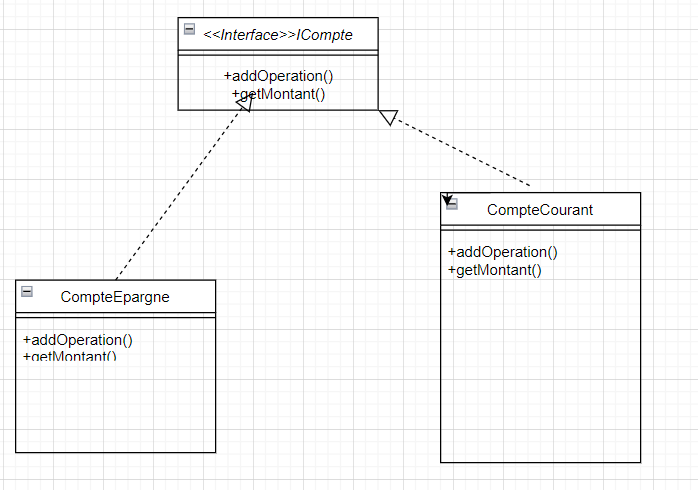

# **exercice 2**
## 1-Le principe du SOLID non respecte:
- Le principe du SOLID non respecte est **Open / Closed principle**
- Si on veux ajouter un autre type de compte on doit changer dans la class compte directement , c'est une violation claire du principe .

## 2-Nouvelle diagramme de classe

## 3-Implementation

## 4-Test

_Noter bien qu'on peut appliquer une meme approache sur la class Operation , si y a une possibilite d'introduire nouvelle type d'operation_