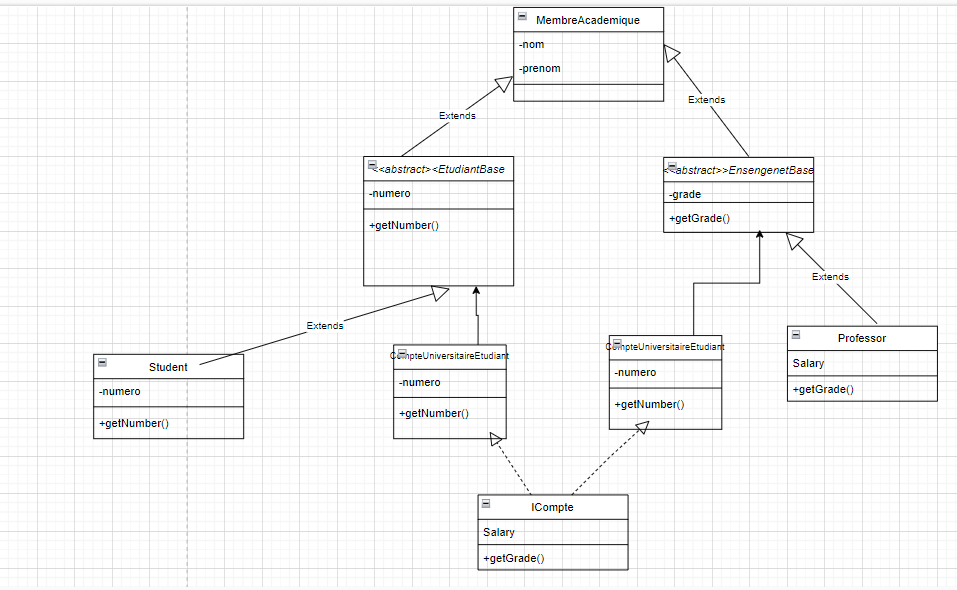

# **exercice 3**
## 1-Le principe du SOLID non respecte:
- Le principe du SOLID non respecte est **Inversion of dependencies**
- y a une dependance direct entre des classes de haut niveau (CompteUniversitaireEnseignent , CompteUniversitaireEtudiant) et les classe du bas niveau (Etudiant et Enseignant)
- On doit dependre de l'abstraction pour une meilleur flexebilite (L'ajout des nouveau modules:Directeur ,EtudiantEtrannger,..)
- On reliant sur l'abstraction on respecte aussi le principe **open /closed** car on va laisser nos entites fermee aux modification mais ouvert aux extensions
:

- ## 2-Nouvelle diagramme de classe

## 3-Implementation

## 4-Test

