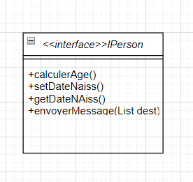
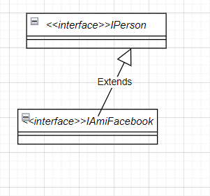

# **exercice 5**
## 1-La solution pour diminuer le couplage:
**L'utilisation de l'abstraction** 

- ## 2-Description de l'interface IPersonne

#### Nouvelle signature du methode add:
```
add(Iperson person)
```
- ## 3-


**L'amelioration possible dans la classe Caledrier c'est l'utilisation direct de l'interface IAmiFacebook comma parametre**
- ## 4-violation de Liskov substitution
- IPerson est non remplacable par une autre interface
